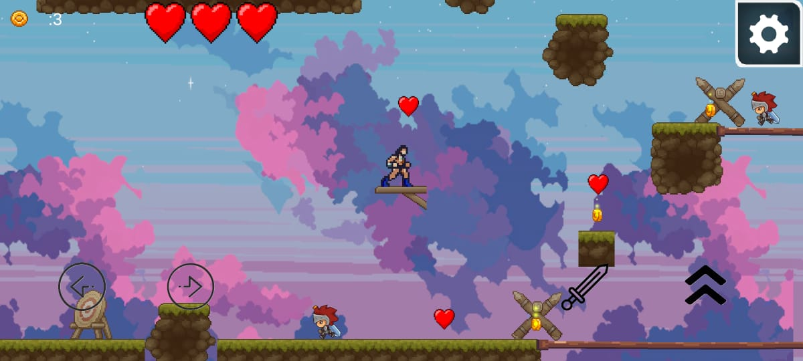

# 🕶️ Comandante

## 🎮 Game Overview

**Comandante** is a cross-platform **2D adventure game** where you play as the legendary revolutionary **Che Guevara**.

Explore a handcrafted world full of challenges, secrets, and unique environments as you fight for freedom and uncover the story behind the revolution.

---

## ✊ Key Features

- 🧭 **Explore a Stylized World**  
  Travel through varied 2D landscapes inspired by historical and fictional settings.

- 🧠 **Che-Inspired Narrative**  
  Take on the role of **Che Guevara** and experience a journey themed around resistance and discovery.

- 🕹️ **Smooth 2D Platforming**  
  Jump, run, and interact with the world using tight and responsive controls.

- 🌐 **Cross-Platform Support**  
  Play on **PC**, **WebGL**, and **Android**.

---

## 🕹️ Controls

### 🖥️ PC / WebGL

| Action      | Key              |
|-------------|------------------|
| Move        | `A` / `D` or Arrows |
| Jump        | `Spacebar`       |
| Interact    | `E`              |
| Pause/Menu  | `Esc`            |

### 📱 Android

- On-screen joystick and buttons for movement and interaction

---

## 🚀 Getting Started
